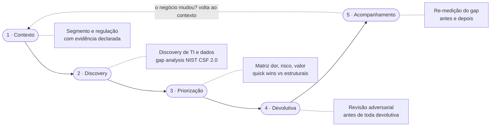
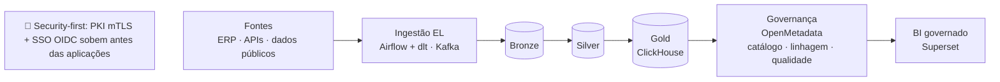

 

---

## 👋 Sobre Mim

Líder de tecnologia com **mais de 20 anos** em infraestrutura de missão crítica no setor financeiro, liderando equipes de até **160 profissionais**. Fui **Diretor de Operações de TI do Grupo Nexxera** por duas décadas de casa, com a diretoria encerrada em maio de 2026.

Desde **junho de 2026** atuo como **consultor independente de tecnologia**: atendo o Grupo Nexxera como cliente e estou **aberto a novos clientes no mercado**. Em paralelo, sou fundador da **Plataforma XPTO**, uma plataforma de governança e inteligência de dados que construo sozinho, orquestrando agentes de IA com disciplina de time de engenharia.

- 📍 Florianópolis, SC, Brasil
- 💼 Consultor independente desde jun/2026 · cliente atual: **Grupo Nexxera**
- 🚀 Fundador da **[Plataforma XPTO](https://xpto.xyz.br)**
- 🔬 Foco: **Prontidão Tecnológica**, **AI-First Engineering**, **Governança de Dados**

---

## 🧭 Consultoria

> **Toda solução começa com um diagnóstico.** Minha consultoria é ampla, cobrindo infraestrutura, dados, segurança, governança e adoção de IA, mas sempre inicia pelo mesmo lugar: um **diagnóstico de prontidão tecnológica** que revela onde a tecnologia sustenta o negócio e onde ela o coloca em risco. A partir dele, o engajamento permeia os temas que a solução exigir.

### O método: Diagnóstico de Prontidão Tecnológica em 5 fases

O pipeline é ancorado em frameworks que um conselho reconhece: **NIST CSF 2.0**, **CIS Controls v8.1 IG1** e **NIST SP 800-53B**. Cada achado percorre a régua **dor declarada → risco evidenciado → valor observável**, com impacto em R$ quando medível.

**Regras que não se negociam:**

- 🔎 **Evidência antes de afirmação:** número só entra em entregável com fonte rastreável; toda devolutiva passa por revisão adversarial registrada antes de chegar ao cliente.
- 🤖 **Agentes aceleram, não assinam:** o trabalho braçal desce para agentes de IA; o julgamento e a assinatura ficam com o consultor.
- ✅ **Pronto de verdade:** o critério de conclusão é o sponsor apresentar o resultado ao próprio conselho, sem o consultor na sala.
- 🤝 **Parceria com quem está dentro:** o diagnóstico aponta caminhos, nunca culpados; a linguagem respeita e fortalece o time do cliente.

### Formatos de atuação

| Formato | O que entrego |
|---|---|
| 🔍 **Diagnóstico de Prontidão Tecnológica** | Avaliação de maturidade e gap analysis: a porta de entrada de todo engajamento |
| 🧩 **Consultoria por projeto** | Da priorização à adoção, com quick wins de até 30 dias separados dos estruturais |
| 🎯 **CIO / CISO / COO as a Service** | Liderança executiva sob demanda, com a bagagem de quem dirigiu TI, Segurança e Operações de uma fintech de missão crítica |
| 🏛️ **Board Advisor** | Apoio a conselhos de administração em risco tecnológico, na linguagem que o conselho reconhece: NIST CSF, SOC, LGPD |

### Setores de atuação

`Financeiro` `Saúde` `Indústria / OT` `Varejo` `Infraestrutura crítica`

---

## 🏗️ Plataforma XPTO

> **[xpto.xyz.br](https://xpto.xyz.br)** · A prova viva do método: uma plataforma de nível enterprise, construída por uma pessoa orquestrando agentes de IA.

Plataforma de **governança e inteligência de dados**: SSOT/MDM, catálogo, linhagem, qualidade e compliance (LGPD/GDPR/AI Act). **On-premises e cloud-native** (Kubernetes), **multi-tenant**, **security-first** e **sem lock-in de fornecedor**.

| | |
|---|---|
| **Princípios** | Componentes open-source intercambiáveis (ClickHouse, Kafka, OpenMetadata, Airflow, Superset, Keycloak, OpenBao); a decisão arquitetural vem antes do produto |
| **Status** | Fundação 100% validada em deploy real; POC vertical completa no ar (ingestão → catálogo → BI governado → IA governada), exposta na internet com SSO |
| **Como é construída** | Desenvolvimento 100% solo com orquestração agêntica: quase **2.000 PRs** merged em pipeline determinístico e auditável (SDD + TDD + gates de qualidade) |

A consultoria e a plataforma se reforçam: o diagnóstico de prontidão pode desembocar na plataforma como solução de dados do cliente.

---

## ⚡ O Que Eu Faço Diferente

Construo **produtos completos** da concepção ao deploy usando uma metodologia própria de **orquestração agêntica**. Em vez de codificar cada linha, eu **projeto, delego e valido**: agentes de IA especializados executam planejamento, implementação, testes e release sob supervisão humana.

- Cada feature passa por **planejamento → implementação → validação → release** com agentes dedicados a cada fase
- **Quality gates automatizados** que barram código fora do padrão antes de chegar à main
- **Clean Architecture** com TDD obrigatório e cobertura rigorosa por camada
- **Rastreabilidade total:** cada commit vinculado a uma issue, cada PR validado por gates

O GitHub vira o **sistema operacional do trabalho**: Issues são tarefas, PRs são entregas, Projects é o kanban, Actions é o CI, e agentes de IA fazem o trabalho pesado.

---

## 📊 Resultados Comprovados

### Como consultor e AI Engineer

| Métrica | Resultado |
|:--|:--:|
| PRs merged na Plataforma XPTO (solo, agêntico) | **~2.000** |
| TDD no código produzido | **100%** |
| Método de consultoria formalizado e reutilizável | **Diagnóstico de Prontidão Tecnológica em 5 fases** |

### Como Diretor de Operações de TI · Grupo Nexxera (ciclo encerrado em mai/2026)

| Métrica | Resultado |
|:--|:--:|
| Transações/ano | **3.5+ bilhões** |
| Volume processado | **R$ 7.3+ trilhões/ano** |
| Uptime crítico | **99.95%+** |
| Aceleração de deploys | **+85%** |
| Redução de custos ERP | **-67%** |
| Conformidade SOC | **95%** |
| Equipe liderada | **160+ pessoas** |

---

## 🛠️ Stack

<b>🤖 AI & Desenvolvimento Agêntico</b>

 

<b>📊 Dados & Governança</b>

 

<b>🔒 Segurança & Plataforma</b>

 

<b>🧩 Competências completas</b>

 

**Engenharia Agêntica & IA:** `Orquestração de Agentes` `Claude Code` `GitHub Copilot` `MCP` `TDD com IA` `Quality Gates` `Clean Architecture` `AI-First Development`

**Consultoria:** `Prontidão Tecnológica` `NIST CSF 2.0` `CIS Controls v8.1` `NIST SP 800-53B` `Gap Analysis` `Discovery de TI e Dados` `Matriz dor risco valor` `Devolutiva executiva`

**Liderança & Gestão:** `Gestão de 160+ pessoas` `KPIs & OKRs` `Planejamento orçamentário` `ITIL` `Scrum` `DevOps` `DevSecOps`

**Infraestrutura & Cloud:** `AWS` `Azure` `GCP` `Kubernetes` `OpenShift` `k3s` `Nutanix` `OpenStack` `High Availability` `Disaster Recovery`

**Segurança & Compliance:** `SOC 1/2 Type II` `LGPD` `Zero Trust` `ISO 27001` `SIEM` `Gestão de vulnerabilidades`

**Domínio de negócio:** `Fintech` `Pagamentos` `Missão crítica` `SaaS` `Alta disponibilidade`

---

## 🏆 Projetos Estratégicos

<b>Ver os 12 projetos do ciclo Nexxera</b>

 

### 📊 Governança de Dados & Data-Driven Transformation
Arquitetura hands-on de plataforma completa: OpenMetadata (catálogo), Airflow (orquestração), Airbyte (ingestão), deploy em OpenShift. Fundação para decisões data-driven em toda a organização.

### 🔄 Modernização Oracle RAC → 2x Exadata On-Prem
Migração de **40TB** com janela de apenas **2h de downtime**, **3x** de melhoria de performance, **99.95%** de uptime em ambiente de missão crítica.

### 💼 Salesforce CRM Implementation
Liderança hands-on: **+55.3%** de crescimento de receita (2021) e **+27.6%** adicional (2024), com transformação completa dos processos comerciais.

### 🔀 Transformação ERP: SAP → NetSuite
Migração completa para ERP cloud-first, com **67%** de redução em custos de licenças.

### 🐳 OpenShift Enterprise Upgrade
Migração de OpenShift Community para Red Hat OCP, containerização enterprise-grade com SLA de 4h para produção e DevSecOps integrado.

### 🔌 MuleSoft API Gateway
Conectividade de **20+ sistemas** internos e externos, arquitetura API-first e governança centralizada de APIs.

### 🤖 RPA para Implantação de Clientes
Automação de 6 macroprocessos de onboarding: **-85%** em erros, trabalho manual equivalente a 8 FTEs eliminado, onboarding de 90 para 30 dias (**-67%**).

### ⚡ Transformação DevOps (PaaS/IaaS)
PaaS (OpenShift) e IaaS (OpenStack) internos, deploys de 260 para 480/mês (**+85%**), CI/CD no lugar do processo ITIL tradicional.

### 🔒 Zero Trust Network
Arquitetura Zero Trust com segmentação rigorosa, autenticação contínua e menor privilégio.

### 🛡️ Cybersecurity Operations Center (SOC)
SOC interno com SIEM, resposta a incidentes, gestão de vulnerabilidades e monitoramento 24/7.

### ☁️ Multi-Cloud Strategy (AWS + On-Premises)
Arquitetura híbrida com workloads distribuídos conforme segurança, performance e compliance.

### 🔐 Compliance & Certificações
SOC 1 & SOC 2 (Type I e II) conquistados e mantidos, programa completo de adequação LGPD, **100% de aprovação em 20+ auditorias anuais** de bancos e operadoras de cartão.

---

## 👔 Trajetória

| Período | Papel |
|---|---|
| **Jun/2026 - Presente** | **Consultor Independente de Tecnologia** · cliente: Grupo Nexxera · aberto ao mercado |
| 2021 - Mai/2026 | Diretor de Operações de TI · Grupo Nexxera |
| 2019 - 2020 | Diretor de Segurança e Infraestrutura de TI · Grupo Nexxera |
| 2017 - 2019 | Diretor de Operações de TI · Grupo Nexxera |
| 2013 - 2016 | Gerente de Operações de TI · Grupo Nexxera |
| 2011 - 2012 | Coordenador de Infraestrutura de TI · Grupo Nexxera |
| 2005 - 2010 | Administrador de Redes e Sistemas · Grupo Nexxera |
| 2000 - 2005 | Suporte e administração de redes · Wavesystem, Ilha da Magia, Fastlane |

<b>🎓 Formação, certificações e eventos</b>

 

**Formação acadêmica**
- Especialização em Redes Corporativas: Gerência, Segurança e Convergência IP · UNISUL (2011)
- Tecnólogo em Telecomunicações · SENAI/SC (2007)

**Cursos e certificações recentes**
- Desenvolvimento Agêntico & Orquestração de LLMs (2025-2026)
- GitHub Copilot Agent Mode & MCP (2025)
- IA com Engenharia de Prompt (2024) · IA Vertex GCP (2024)
- Design de Serviços (2022) · Machine Learning & Big Data (2018)
- Cloud Google Operations (2017) · Python (2016) · Lean IT (2016)
- COBIT (2014) · ITIL (2010) · Cisco Academy (2002)

**Eventos internacionais**
- Oracle World · Las Vegas (2023)
- Lenovo Executive Briefing · Carolina do Norte (2023)
- Nutanix Next · Barcelona (2024)

**Idiomas:** 🇧🇷 Português (nativo) · 🇺🇸 Inglês (avançado) · 🇪🇸 Espanhol (básico)

---

## 📰 Cases Publicados

---

## 📫 Vamos Trabalhar Juntos?

Um engajamento comigo começa simples:

1. **Conversa inicial** para entender a dor declarada e o contexto do negócio
2. **Diagnóstico de prontidão tecnológica** com evidência, ancorado em NIST CSF 2.0 e CIS Controls
3. **Plano priorizado** com quick wins de até 30 dias separados dos estruturais, cada recomendação com dono e valor observável

Temas em que posso ajudar: prontidão tecnológica e gestão de risco, governança de dados, infraestrutura de missão crítica, cloud híbrida, segurança e compliance (SOC, LGPD, Zero Trust), adoção de IA e desenvolvimento agêntico, tecnologia para o setor financeiro e pagamentos.

### 💬 Me chame para conversar

 

